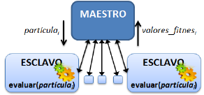
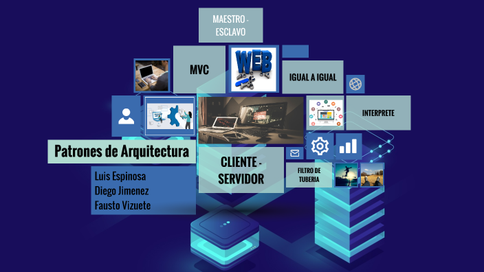
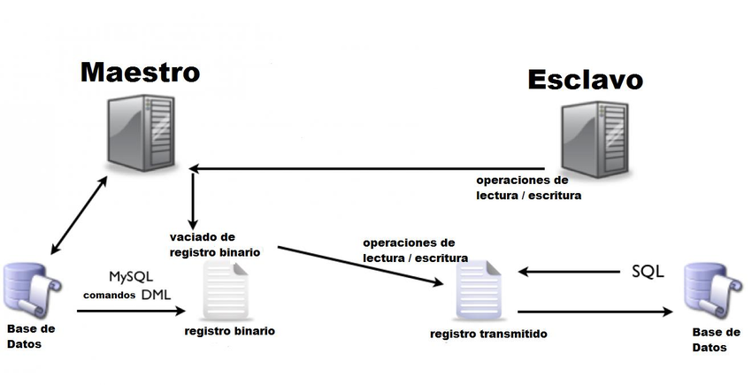

#patrones arquitectonicos 
> [!NOTE]
> 👍Un **patron arquitectonico** es una solucion general y reutilizable de un problema comun en la arquitectura de software dentro de un contexto dado. Los patrones arquitectonicos son la habilidad de organizacion a nivel de carpetas dentro de un proyecto de software.

PATYRONES ARQUITECTONICOS MAS CONOCIDOS 
1. PATRON DE CAPAS
2. PATRON CLIENTE-SERVIDOR
3. PATRON MAESTRO-ESCLAVO
4. `PATRON FILTRO DE TUBERIA`
5. PATRON DE INTERMEDIARIO
6. PATRON DE IGUAL A IGUAL 
7. PATRON DE BUS EVENTO
8. MODELO-VISTA-CONTROLADOR
9.  ARQUITECTURA LIMPIA
10. ARQUITECTURA HEXAGONAL
    

### PATRON MAESTRO-ESCLAVO

> 👍INTRODUCCION
> El patrón Maestro / Esclavo se usa más comúnmente cuando se responde a los controles de la interfaz de usuario mientras se recopilan datos simultáneamente. Suponga que desea escribir una aplicación que mida y registre un voltaje que cambia lentamente una vez cada cinco segundo
### FUNCION 
>Patrón Maestro-Esclavo, elaboración propia. Este patrón puede utilizarse para estructurar sistemas que producen y procesan un flujo de datos. Cada paso de procesamiento está encerrado dentro de un componente de filtro. Los datos que se van a procesar pasan a través de tuberías

### ¿POR QUE UTILIZAR MAESTRO/ESCLAVO?
> El patrón de diseño Maestro/Esclavo es muy ventajoso cuando creamos aplicaciones multi-tarea. Le da un enfoque más modular al desarrollo de la aplicación debido a su funcionalidad multi-bucle, pero más importante, le da un mejor control de la gestión de tiempo en su aplicación. Cada bucle paralelo es tratado como una tarea o hilo separado. Un hilo se define como la parte de un programa que se puede ejecutar independientemente de las otras partes. Si tiene una aplicación que no utiliza hilos separados, esa aplicación se interpreta por el sistema como un hilo. Cuando separa su aplicación en múltiples hilos, cada uno comparte el tiempo de procesamiento por igual entre ellos.

### VENTAJAS Y DESVENTAJAS DE PATRON MAESTRO/ESCLAVO

>VENTAJA 
El patrón de diseño maestro / esclavo es muy ventajoso al crear aplicaciones multitarea. Le brinda un enfoque más modular para el desarrollo de aplicaciones debido a su funcionalidad de bucle múltiple, pero lo más importante es que le brinda más control de la administración del tiempo de su aplicación.

>DESVENTAJA
La principal desventaja es que puesto que el patrón de diseño Maestro-Esclavo no está basado en sincronización, por ello es posible que el bucle esclavo inicie su ejecución primero que el bucle maestro.

### DEFINICION  
>El patrón de diseño Maestro / Esclavo es otra arquitectura fundamental que usan los desarrolladores de LabVIEW. Se utiliza cuando tiene dos o más procesos que deben ejecutarse de forma simultánea y continua, pero a diferentes velocidades.

